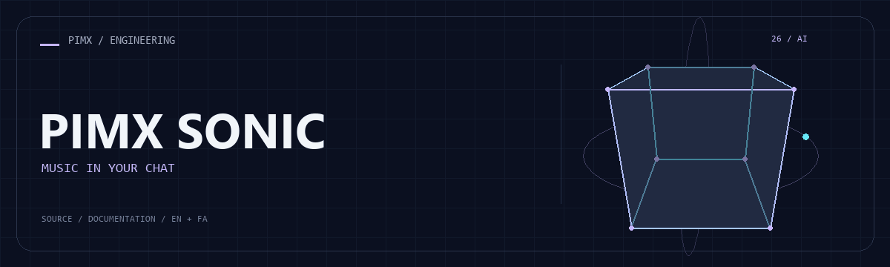

<div align="center">



**[English](README.md) · [فارسی](README.fa.md)**

</div>

# 🎧 PIMX SONIC

A Python Telegram music/media bot using yt-dlp, asynchronous HTTP, inline controls and local persistence helpers.

[GitHub](https://github.com/MOHAMMADREZAABEDINPOOR/PIMX_SONIC_BOT) · [PIMX / Profile](https://github.com/MOHAMMADREZAABEDINPOOR) · [Static artwork](assets/readme/hero.png)

| At a glance | Details |
|:---|:---|
| 🎧 Experience | Telegram bot and its supporting tools |
| 🧰 Built with | `Python` |
| 🌐 Documentation | [English](README.md) · [فارسی](README.fa.md) |

[✨ Features](#features) · [🚀 Getting started](#getting-started) · [⚙️ Configuration](#configuration) · [🌍 Deployment](#deployment)

---

<a id="features"></a>

## ✨ Features

| Area | Included capability |
|:---|:---|
| 📥 Delivery | Media search and URL processing |
| ⚡ Workflow | Audio/video handling through yt-dlp |
| ⚡ Workflow | Interactive Telegram controls |
| 🌐 Experience | Local database and cleanup helpers |

<a id="stack"></a>

## 🧰 Stack

| Tool | Version / source |
|---|---|
| Python | `standard library / source imports` |

<a id="getting-started"></a>

## 🚀 Getting started

Python 3; a desktop/Tk installation for Tkinter or turtle examples. Tkinter is provided by the Python installation, not pip. Legacy dependencies may need a compatible Python version.

```bash
git clone https://github.com/MOHAMMADREZAABEDINPOOR/PIMX_SONIC_BOT.git
cd PIMX_SONIC_BOT

python -m pip install "python-telegram-bot>=20,<23" yt-dlp aiohttp jdatetime requests beautifulsoup4
python main2.py
```

<a id="configuration"></a>

## ⚙️ Configuration

No standard environment template is defined. Standalone exercises need no external configuration; inspect any service constants or paths in the source before running.

<a id="usage"></a>

## 🎯 Usage

Review credentials and source settings in main2.py, install the imported third-party packages and ensure FFmpeg is available for audio processing. Start the script and use the bot menu.

<a id="project-structure"></a>

## 🗂️ Project structure

| Path | Role |
|---|---|
| [`assets/`](assets/) | Brand/media/README assets |
| [`main2.py`](main2.py) | Project entry/configuration file |

<a id="commands-and-checks"></a>

## 🧪 Commands and checks

No automated test command is declared in a manifest. Verify behavior through a local example run.

<a id="deployment"></a>

## 🌍 Deployment

Host a long-running bot process with environment secrets and private storage. Run a single polling instance. Check network access and dependency compatibility on the host.

<a id="limitations"></a>

## 📌 Limitations

Provider extractors and Telegram upload limits constrain delivery. Some bootstrap code downloads external utilities. A dependency manifest is absent, so the suggested install list is a starting point.

<a id="troubleshooting"></a>

## 🛠️ Troubleshooting

- Authentication/provider errors: verify credentials and selected model/provider.
- No Telegram updates: check polling/webhook mode and concurrent bot instances.
- Missing dependencies: use the declared manifest or inspect imports if no manifest is provided.

<a id="contributing"></a>

## 🤝 Contributing

Create a focused branch, verify the affected behavior and explain the change clearly. Keep private data, build outputs and local databases out of commits.

<a id="license"></a>

## 📄 License

No repository-level license file is included in this snapshot. Public visibility alone does not grant reuse rights; contact the repository owner for terms.

---

Part of **PIMX** · Documentation in English and Persian.

---

<div align="center">

🎧 **PIMX SONIC** · [English](README.md) · [فارسی](README.fa.md)

</div>
